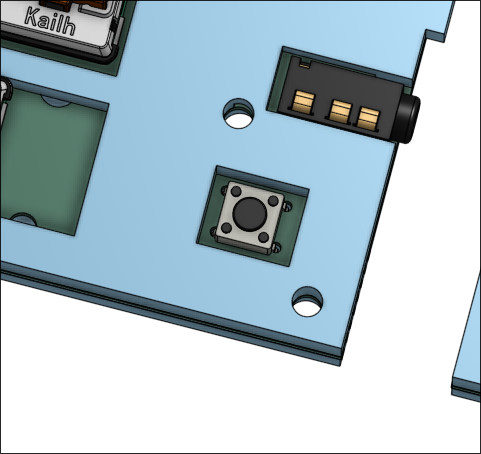

Est. time spent: 19h

## 4 June 2025
So this is the start of my keyboard! Hi! I'm Gabriel. This is going to be probably my first medium-scale PCB project!
I'm going to actually start design work for this on Sunday because I'm going to compete with my friends to see who can
keyboard the fastest. But my basic design concept is:

- split ortholinear design
- physical switch to toggle between languages/scripts (US QWERTY, French Canadian Multilingual, Greek layout, custom Hiragana layout, custom Katakana layout)
- low profile design
- neopixels reacting to events and languages
- OLED displays per side
- USB hub
- RP2040 (either a stamp or just a breakout board)

Yeah, that's about it!

## 13 June 2025

Estimated time spent: 4h

So I actually forgot to journal the work I did. On Sunday (8 June), I got most of the schematic done and started working on the PCB itself.

Unfortunately, I was really really dissatisfied with the PCB because it was sad and bad and low quality. So today I deleted the work I had so far and started fresh.

A problem that I noticed was that my hub had to be able to handle 5V1A through VBUS. I could use thicker copper traces (2oz?) but that would be kinda expensive. Then again, I'm using the same amount of copper regardless so that it can all handle the current. So I honestly have no idea what to do now; I'm just going to wire it up anyways and hope for the best. Also, the components that I'm using need to be able to handle all of that.

I have 35 SK6812Minis, a PGA2040, an SSD1306, and 3 downstream USB ports. I might be fried, honestly. I need to be running, like, what, 2.1A? to get everything running? I might lower the neopixel brightness so my board doesn't implode on itself.

Gonna start wiring now. Wish me luck.

## 13 June 2025

Wired up the USB hub part without ground yet.

## 17 June 2025

Estimated time spent: 3h

Finished up pretty much the entire left side! DRC keeps throwing errors but they're problems with the footprints I used, not with my actual design (hopefully).

So I forgot that neopixels existed and spent the entirety of this morning trying to route them all. It was not fun. As well, I forgot how to do a ground pour and spent half an hour routing that before I realized I could just ground pour it. But it's mostly done now! Just time to do the other half. I know the layout, time to repeat it!

## 29 July 2025

Time spent: 4h

I kinda forgot I was working on this because of Neighborhood. But anyways, with like 2 days left to design, I realized that my original design was far too ambitious. So I started again from the schematic, replacing the PGA2040 (they stopped manufacturing thoughs) with a regular Raspberry Pi Pico, dropped the LEDs, rotary encoder and USB hub. 

This is what it ended up looking like. So I took it and routed the PCB again, ending up with this. 

I also added the TRRS jack so that both halves could communicate with I2C. I'm pretty sure QMK supports that by default but I'm not sure, so tomorrow I"m going to have to actually code the firmware for it. Hopefully it doesn't take too long.

I'm overall pretty happy with how this is looking. It's a lot cleaner. I'm not sure how mounting it to a case will work but we'll get to that when we get there. 

## 30 July 2025

Time spent: 1.5h

So I tried making some firmware. I honestly have no idea what I'm doing so I just stole from the docs a lot. Not even sure what any of this does, but it should line up with my layout.

It should communicate using I2C but to be fully honest I have no idea how to implement that. 

According to QMK, split keyboards should look like this. It looks really cursed but it should work out.

I'm honestly not too too sure what the ideal layout for Raise and Lower should look like. Maybe something like Fn (which I don't think really works yet) but I think it's one of the things that I'll figure out when I actually manufacture.

## 31 July 2025

Time spent: 6.5h

Okay, so, last day, so things are getting really stressful. Got up at 4am.

I made the BOM, which is pretty cool. Turns out I'll probably need header pins too. 

Also, I redid the board outline and added mounting holes for easier design later.

 Ended up moving all of the footprints to a local library so I could add 3D models, and I think it looks pretty good so far. 

 Started work on the case. It was actually surprisingly difficult (mostly because I'm bad at CAD but whatever). I ended up using 3.2mm holes for the top part and 4mm holes for the bottom (since I'll be adding heatset inserts).

The hole on the pico is intentionally large so you can hit the BOOTSEL button on both the left and right halves which is cool.

The top right case is looking pretty good, just gonna mirror it for the left side with a few tweaks since for some reason the holes on the left aren't in the exact same positions.

It's 5pm as I'm typing this and I lowkey got up at 4am to finish all of this.

I just realized my two halves are different sizes.

Took me a while but finally fixed the asymmetry. (Not in the PCB, though, I'm too lazy for that.)

Also made this grill thing (not sure what it's called) but it should protect the diode contacts underneath from getting really dirty.

Man, it's 6:45. I need to get this done but also eat dinner.

Almost forgot the lang switch button!

But yeah, full assembly is looking amazing, I think. Not too bad for what is effectively my first attempt at CAD. I think this literally took me about 5 hours to make. Honestly not sure what kind of keycaps I'm going to use but I think I'll custom design some!

Okay, firmware time.

So, it's kinda weird, because I'm pretty unfamiliar with how QMK and split keyboard comms work. I'm assuming that through using I2C QMK deals with it automatically since I'm not doing custom data sending (as of yet). But, I set it up according to the docs, and I can only wait to flash it to my pico to see if it'll work or not. If it works as intended, great! I have a barebones functioning keyboard from which I can build all of my cool advanced functionality that I unfortunately do not know how to do yet without testing. If it doesn't, that's okay too! It means I get to figure out what's wrong.

## Bill of Materials

| Item | Cost (each) | Quantity | Total |
|---|---|---|---|
| | $0.48 (10 pack) | 70 | $33.60 |
| | $0.50 | 2 | $1.00 |
| | $0.0486 (100 pack) | 70 | $4.86 |
| | $0.311 (10 pack) | 6 | $3.11 |
| | $1.15 | 2 | $2.30 |
| | $0.15 | 1 | $0.15 |
| | $5.75 | 1 | $5.75 |
| | $0.014 (10 pack) | 4 | $0.14 |
| | $1.25 | 1 | $1.25 |
| | $0.1826 (50 pack) | 10 | $9.13 |
| | $0.149 (10 pack) | 10 | $1.49 |
|PCB| $6 (5 pack, including shipping) |  1 | $30.05 |
|Total| - | - | $92.68 |

